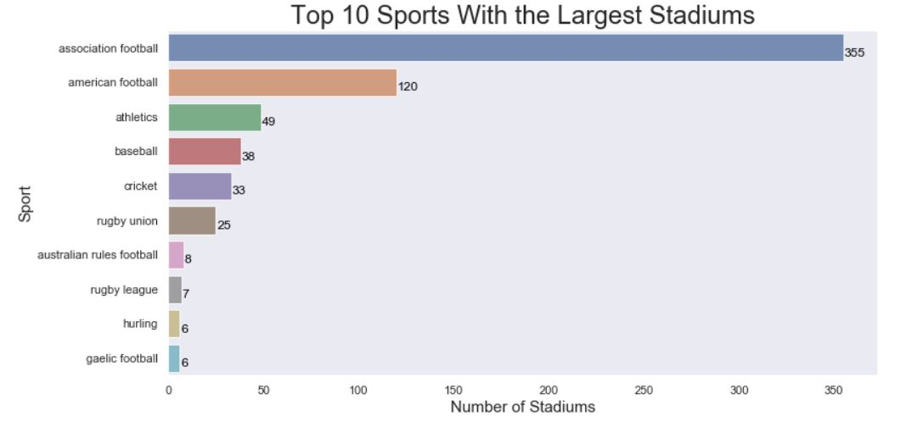

# Stadium Capacity
This was my first time web scraping data. I have often seen code gathering data from the internet, and I wanted to try it on my own. I used Python and the Beautiful Soup package to get the data from [Wikipedia](https://en.wikipedia.org/wiki/List_of_stadiums_by_capacity). 

Then I used pandas and Python's core functionality to clean the data. Following the data exploration and cleanup, I visualized and analyzed a little bit of the data with the graphing package seaborn.

<strong> Favorite Part of the Code: </strong>
I was really happy with how I was able to fix my top 10 charts at the end of this notebook. The sport column had lists of multiple sports in one cell if the stadium was used for multiple sports. I was able to split these lists with Python code to get an accurate count of the sports. 

Here is the before chart:

After:

### Potential Improvements
- There are opportunities to explore and graph more data
- Could turn this into a web app with Dash, a package I want to explore